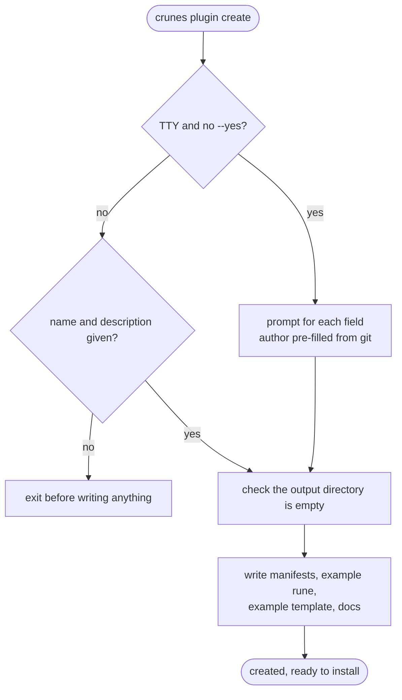

# `crunes plugin create`

Generates a complete, immediately-installable plugin. The interesting part is not the file list — it is that the scaffold produces **two** manifests.



## Two manifests, two jobs

**`plugin.json`** is the runtime manifest. The CLI reads it at install and at execution: it declares the runes, the templates and the lifecycle-scoped permissions.

**`marketplace.json`** is the publishing entry point, and it carries `source: "./"`.

That one line is what makes the repository its own single-plugin marketplace. It resolves to the repository root when the marketplace loader reads it, so:

```bash
crunes marketplace add ./my-plugin
crunes plugin install my-plugin@my-plugin
```

works against a local checkout with **no build and no publishing server.** Because a local marketplace source is used in place rather than copied, the plugin directory becomes the live cache and edits to rune files take effect immediately — see [plugin install](/flows/plugin-install.md).

This is the whole local development loop, and it exists because [provenance is required](/flows/plugin-install.md): there is no direct path install, so development had to be made to work *through* a marketplace rather than around one.

## The scaffolded rune exports `run`

`runes/example.js` exports `async function run(args)`. This matters because the old `use(args)` name still appears in older plugins and **fails only at invocation**, not at install — the scaffold exists partly to stop that name propagating.

`templates/example-template.js` is structurally the same file with a different destiny: it is meant to be copied into a user's project by [`template apply`](/flows/template-apply.md) and run as a local rune from there.

## Two failure behaviours worth knowing

**Git author detection fails silently.** `git config user.name` is read through `spawnSync`; if git is absent or unconfigured the field is left blank rather than blocking the scaffold.

**There is no rollback.** Files are written sequentially, so a failure midway leaves a partial directory. Recovery is to point `--out` at a clean location and run again — which is also why the directory check happens before any write rather than during.
