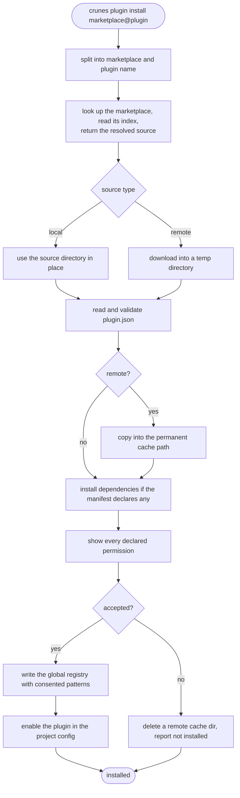

# `crunes plugin install`

A trust-and-validate pipeline. Nothing is registered until the manifest has been read and the user has agreed to what it asks for.

## Provenance is required, not preferred

`installPlugin` throws immediately if `provenance.marketplaceName` is absent. **There is no `./path` install bypass.**

Every installed plugin must trace to a named marketplace source, because a consent record is only meaningful if it is tied to an auditable origin. A plugin under development follows the same path as a remote one — the difference is entirely in what the marketplace source resolves to, not in the pipeline.

## Staging is deliberately asymmetric

**Local sources are used in place.** The resolved path *is* the cache directory; nothing is downloaded and nothing is deleted. That is what makes edits to a plugin under development take effect with no reinstall.

**Remote sources stage into a temp directory**, are validated there, and are copied to `<store>/plugins/<marketplace>/<name>@<version>` only after the manifest passes. The temp directory is removed in a `finally`, so a failure at any later step leaves nothing behind.

The asymmetry is the point: cleanup that deleted a local source would delete the user's working copy.

## Validation precedes consent, which precedes registration

Order matters at each step.

**The manifest is validated first**, so a malformed plugin fails with field-level detail before the user is asked to approve anything. Staging cleanup runs before the error reaches the caller.

**Consent is then taken against the declared permissions.** Declining deletes a remote cache directory and reports *not installed*, exiting 0 — a refusal is a valid outcome, not an error.

**Accepting freezes the per-rune allow patterns** as `consentedPermissions` in the registry entry. That snapshot is what a later update diffs against, so only new or escalated patterns are ever re-shown — see [plugin](/modules/plugin.md).

## Two registries, written last

The global registry records what is installed on the machine; the project config records that it is enabled here. Both are written only after consent.

The project write uses an atomic temp-file rename, and **silently skips when there is no project config** — installing from a rootless directory registers the plugin on the machine without enabling it anywhere.
