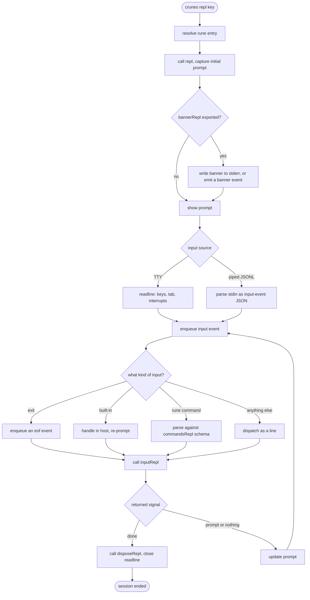

# `crunes repl`

The key resolves exactly as it does for [`crunes run`](/flows/run.md). What differs is everything after: `repl()` is called once to initialise, and then the isolate **stays alive** while `inputRepl()` handles each input.

Module-level variables in the rune are session state. A connection opened during `repl()` is still open on the tenth input.

## The host owns the terminal, the rune owns the semantics

Readline, slash commands, tab completion and multiline buffering are all host concerns. The rune never sees a keystroke — only a cooked input event whose `type` is `line`, `command` or `eof`.

That split is what lets the same rune serve an interactive terminal and a programmatic client with no branch in the rune.

**Initialisation happens once.** `repl(args)` is called a single time and its return value becomes the initial prompt (or `"> "`). It is not called per input, and a rune that treats it as a per-input hook will initialise nothing.

## An async queue serialises everything

When stdin is a pipe, readline fires every `line` event synchronously, before any async handler has resolved. Without serialisation the handlers interleave and a session processes input out of order.

An explicit promise chain enqueues each event so they run strictly in sequence. Rune authors never see this, and JSONL clients depend on it entirely.

## Multiline and completion

**Multiline is TTY-only.** Ctrl+Enter buffers the current line and shows a continuation prompt indented to the main prompt's width; the next Enter flushes the buffer as one `line` event containing newlines. Ctrl+C on a non-empty buffer clears it and re-prompts instead of interrupting the session.

**Completion is delegated.** If the rune exports `completeInputRepl(tokens)`, it is wired to the readline completer. Tokens are the input split on whitespace with the partial word last; the host filters the returned candidates by prefix.

## Permissions are a separate block

A `repl` session is governed by `"repl"` grants, and **nothing is inherited from `"run"`.** A rune doing the same work in both modes declares the grant in both blocks.

The reason is proportion rather than symmetry: a session holds an isolate open and accepts arbitrary further input, which is a materially larger thing to authorise than one call that ends.

## Driving a session programmatically

In JSONL mode stdin is newline-delimited input events and stdout is event objects — the wire protocol for a non-human client.

A caller need not format those lines by hand. `RuneSession.writeCommand(nameOrText, args?)` and `rune.job.writeCommand(id, ...)` send a command as a structured value, and the REPL input stream accepts both plain text and structured command events. For a REPL running as a [job](/modules/job.md), input is appended to a tailed `stdin.log`, which is what lets the session survive a parent restart.
