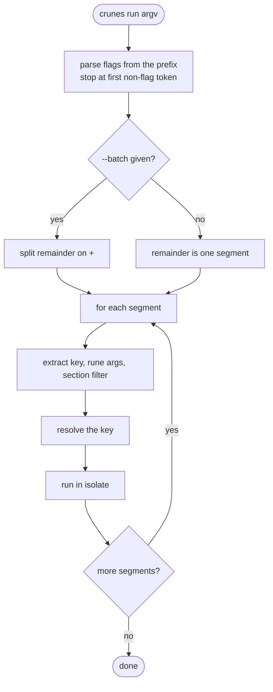
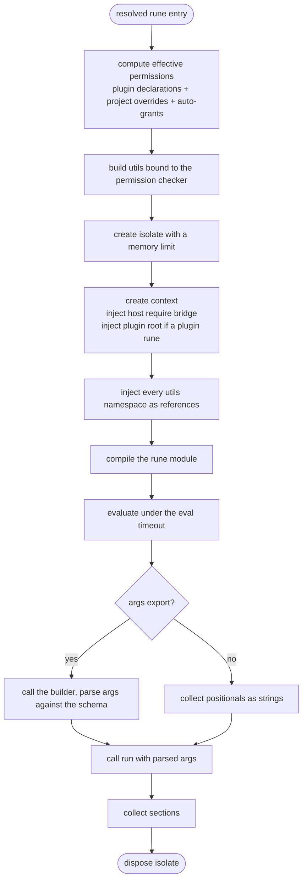

# `crunes run`

One or more rune keys are resolved, each rune executes in its own isolate, and sections reach stdout progressively rather than all at the end.

## Flag parsing stops early

`parseRunArgs` walks argv and halts at the first token that is not a known command flag. Everything from there belongs to the rune, **including tokens that look like flags**.

This is what gives a rune author their own argument space. A rune may declare `--format` without colliding with the command's `--format`, because the command stopped reading before it got there.

`-b` / `--batch` is opt-in for the same reason. Without it, `+` is an ordinary argument; with it, `+` separates independent invocations. Making batching the default would silently break any rune that uses `+` in its own arguments.

## Resolution tiers

Tried in order, first match wins:

| Key form | Path taken |
|---|---|
| `local:key` | project config only |
| `plugin:name` | the named plugin, directly |
| bare key with a `plugin` field in config | alias, re-dispatched to that plugin rune |
| bare key with no config entry | every enabled plugin, refusing if two claim it |

The refusal on ambiguity is the load-bearing part — see [rune](/modules/rune.md).

## Isolate setup

Permissions are computed **before** the isolate exists, and the checker is bound into the utils object as it is built. There is no moment at which a capability is reachable without its check, because the unchecked function is never placed on the bridge.

The isolate is disposed immediately after. Nothing is pooled or reused, so no state can leak between invocations — see [the isolate boundary](/patterns/sandbox-isolation.md).

## Output arrives in two waves

**During execution**, `onEvent` fires as the rune emits, so a long-running rune produces output while it works rather than at the end.

**After execution**, a flush emits anything the rune returned but never emitted progressively.

A rune therefore has two ways to produce a section and need not choose deliberately: emitting streams it, returning it flushes it, and returning something already emitted does not duplicate it.

The section filter (`key[-s name]`) applies to this output after the rune finishes, never inside the isolate.

## The JSONL format is also a wire protocol

`--format jsonl` is not only for humans piping output. It is what `rune.exec` parses when one rune calls another as a child process, so the same render path serves interactive streaming and inter-rune communication.

Child spawns receive `CRUNES_NO_TIMEOUT=1`, so a slow child does not consume the parent's evaluation budget and cascade into a timeout that names the wrong rune.
