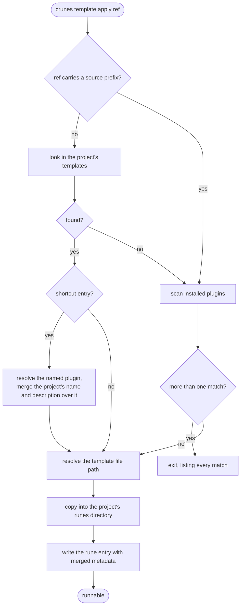

# `crunes template apply`

Turns a scaffold into a runnable rune. The result lands in `config.runes`, not `config.templates`, so it is executable immediately — that distinction is the whole difference from [`template create`](/modules/template.md).

## The project owns its template namespace

A bare name checks the project's own templates first and only then falls through to plugins. A `source:` prefix skips the project entirely.

So a project may deliberately shadow a plugin template with its own, and still reach the shadowed one explicitly. Ambiguity **across plugins** with no prefix is refused with the full list rather than resolved by picking.

## Permissions come along

A plugin template carries its declared permissions into the resulting rune entry. The user gets a rune that runs correctly on first invocation instead of one that fails on its first `fs.read` and has to be wired by hand.

## Shortcut entries rename without forking

A project entry with a `plugin` field instead of a path says: *this project's word for this thing is that plugin's template.* On apply, the shortcut's `name` and `description` are merged **over** the plugin's metadata.

The plugin's files are never touched. Only what the user sees changes, which is what makes this a rename rather than a fork — a fork would have to be re-synced every time the plugin's template improved.

The plugin is looked up by bare name, so two plugins sharing one throws; the fix is the qualified `marketplace@name:templateKey` form in the shortcut.

## Writing is atomic and unconditional

The config write uses a temp-file rename, so an interrupted apply leaves the previous config intact.

The entry itself **replaces** any existing one with the same key, with no merge of existing permissions or vars. That makes apply idempotent and predictable, and it means re-applying over a rune whose permissions were hand-tuned discards the tuning.

On the file itself: a TTY prompts before overwriting, while `--yes` or any non-TTY context — CI, an agent — proceeds silently. The config entry is overwritten either way.

`--as <key>` moves the rune key and the default file path together; `--path` moves only the file.
