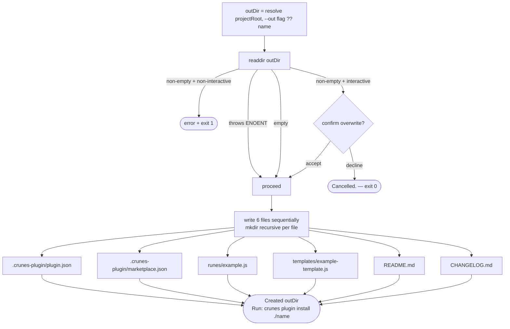

# `crunes plugin create` Flow

> A new plugin scaffold is generated with dual manifests, example rune and template files, and documentation stubs.

**Modules:** [[modules/plugin]], [[modules/shared]]

## Overview

Creating a plugin produces six files that together form a complete, immediately-installable plugin. The two manifests serve distinct purposes: `plugin.json` is the runtime manifest that `crunes` reads at install and execution time — it declares runes, templates, and permissions; `marketplace.json` is the publishing entry point that lets the repository function as its own single-plugin marketplace. This dual-manifest design enables local development without a separate publishing server — a developer can point `crunes marketplace add` at the repo directory and install from it directly.

The `source: "./"` entry in `marketplace.json` deserves particular attention. It resolves to the repo root when read by the marketplace loader, which means `crunes marketplace add ./path` followed by `crunes plugin install <marketplace>@<name>` works against a local checkout with no build or publish steps. The plugin directory becomes the live cache, so edits to rune files take effect immediately.

Git author auto-detection runs via `spawnSync` on `git config user.name` and fails silently if git is unavailable or unconfigured — the field is left blank rather than blocking the flow. There is no rollback: files are written sequentially, and a failure midway leaves the output directory in a partial state. Recovery is to specify a clean `--out` directory and run again.

## Walkthrough

### Submission

```mermaid
flowchart TD
    A([crunes plugin create]) --> B{TTY and no --yes?}
    B -- interactive --> C[/@clack/prompts: name · description · author · license/]
    C --> D{cancel signal?}
    D -- yes --> E([Cancelled. — exit 0])
    D -- no --> F[resolve inputs]
    B -- non-interactive --> G{name or description missing?}
    G -- yes --> H([error + exit 1])
    G -- no --> F
    F --> I[author = --author flag ?? git config user.name\nlicense = --license flag ?? 'MIT']
```

**Mode detection** happens first. `--yes` or a non-TTY stdout forces non-interactive mode; missing `name` or `description` in that mode exits immediately before any file is written. In interactive mode `@clack/prompts` handles each field, with the git-detected author pre-filled as the initial value. Any cancel signal from the prompt exits cleanly.

### Directory Check and File Generation



**`plugin.json`** declares the rune and template catalog with lifecycle-scoped permissions (`{ "run": { "allow": [], "deny": [] } }`). Adding a new rune here triggers re-consent on next update even if existing runes are unchanged. **`marketplace.json`** makes the repo its own one-plugin marketplace via `source: "./"`. **`runes/example.js`** exports `async function run(args)` — the correct lifecycle name; the old `use(args)` export fails at runtime. **`templates/example-template.js`** is structurally identical but is meant to be copied into user projects via `crunes template apply` and run as a local rune from there.

## Error Paths

- **Missing name or description (non-interactive):** exits 1 before writing any files; the error message names the missing field.
- **Non-empty output directory (non-interactive):** exits 1 with a hint to use `--out` for a clean target.
- **Non-empty output directory (interactive):** confirm prompt; declining exits 0 with "Cancelled."
- **File write failure midway:** no rollback; output directory is left in a partial state — re-run with a clean `--out` directory.

## Key Decisions

- **Dual manifests for dual audiences:** `plugin.json` is the runtime contract; `marketplace.json` is the discovery contract. Separating them lets the publishing format evolve without touching the runtime manifest.
- **`source: "./"` enables self-serve local development:** the relative path resolves to the repo root, making any local checkout immediately usable as a marketplace source — no server, no publish step.
- **Git author with silent fallback:** pre-fills the interactive prompt but never hard-fails; avoids making git a hard dependency while keeping the common case frictionless.
- **No atomic write or rollback:** sequential writes are an accepted trade-off for simplicity — plugin creation is interactive and infrequent, and the recovery path is a clean `--out` directory.
