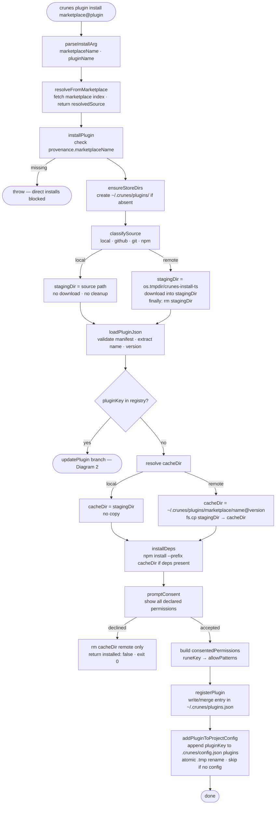
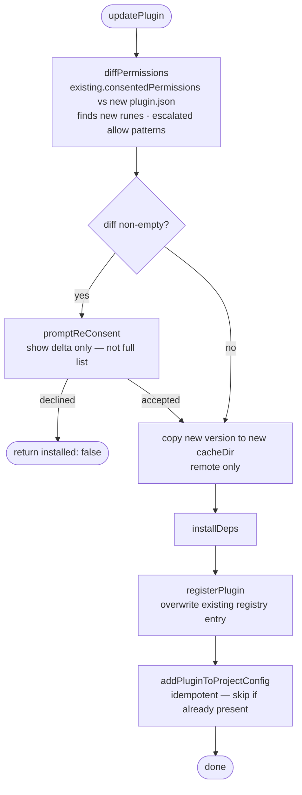

# `crunes plugin install` Flow

> A plugin is resolved from a marketplace, downloaded or linked, validated, consented to, and registered in both the global store and the project config.

**Modules:** [[modules/plugin]], [[modules/marketplace]], [[modules/core]], [[modules/shared]]

## Overview

Installing a plugin follows a trust-and-validate pipeline. The command parses `marketplace@plugin` into its two parts, resolves the plugin source URL from the marketplace index, classifies the source as local, GitHub tarball, Git clone, or npm pack, downloads or links it into a staging area, validates the manifest, prompts the user for permission consent, and finally writes to two registries: the global plugin store and the project config. The two-registry design means a plugin is installed once across the machine but can be enabled or disabled per project independently.

The provenance requirement is fundamental to the security model. `installPlugin` throws immediately if `provenance.marketplaceName` is absent — there is no direct `./path` install bypass. Every installed plugin must be traceable to a named marketplace source so that consent records are tied to a specific, auditable origin. Development plugins follow the same resolution path as remote ones; the difference is only in what the marketplace source type resolves to.

Staging and cleanup are asymmetric by design. Local plugins skip download entirely — the source directory is used directly as `cacheDir`, so code changes take effect without reinstall. Remote plugins download to a temp dir, validate, copy to the permanent cache location, and have the temp dir cleaned up in a `finally` block regardless of success or failure. This prevents orphaned temp files while preserving live local sources.

## Walkthrough

### Diagram 1 — Install path

**Parse and resolve** — `parseInstallArg` splits the `marketplace@plugin` argument on `@`, exiting 1 immediately with a format hint if no `@` is present. `resolveFromMarketplace` looks up the named marketplace in `~/.crunes/marketplaces.json`, fetches its index (cached for `github`/`npm` type sources, live for `http`/`local`), and returns `{ resolvedSource, marketplaceName, pluginName }`.

**Source classification and staging** — `classifySource` maps the resolved source to one of four types. Local sources are paths starting with `./`, `~/`, or an absolute prefix; everything else is a remote fetch. Local staging is a no-op: `stagingDir` is set to the resolved path and nothing is downloaded or deleted. Remote sources write to a fresh temp dir that is always removed in `finally`, even if a later step throws.

**Manifest validation** — `loadPluginJson` reads and validates `plugin.json` from the staging dir. A missing or malformed manifest throws `ValidationError` with field-level detail. Staging cleanup happens before the error surfaces to the caller.

**Cache copy and deps** — For remote sources, the validated staging dir is copied to the permanent cache path `~/.crunes/plugins/<marketplace>/<name>@<version>`. `installDeps` runs `npm install --prefix cacheDir` only if `plugin.json` declares dependencies.

**Consent and registration** — `promptConsent` displays all declared permissions. Declining deletes the remote `cacheDir` and returns `{ installed: false }`; the CLI exits 0. Accepting freezes the per-rune allow patterns as `consentedPermissions` in the registry entry. `addPluginToProjectConfig` appends the `pluginKey` to `.crunes/config.json` using an atomic `.tmp` rename; it silently skips if no config file exists.

---

### Diagram 2 — Update branch

**Permission diffing** — `diffPermissions` compares the stored `consentedPermissions` snapshot against the incoming `plugin.json`. It surfaces two classes of change: runes that are new to the plugin (adding a new rune always triggers re-consent even if its patterns are identical to another rune's) and existing runes with escalated or broadened allow patterns.

**Selective re-consent** — `promptReConsent` shows only the delta. Permissions the user already approved are never re-displayed, preventing prompt fatigue while keeping capability additions visible. Declining returns `{ installed: false }` without modifying the registry; the old version remains installed and active.

**Idempotent registration** — `registerPlugin` overwrites the existing registry entry in full. `addPluginToProjectConfig` checks whether `pluginKey` is already present before appending, making the update path safe to re-run.

---

## Error Paths

- **Missing `@` in argument** — Exits 1 with a format hint before any network I/O. No marketplace lookup is attempted.
- **Marketplace not registered** — `resolveFromMarketplace` throws. The user must run `crunes marketplace add` first.
- **Plugin not in marketplace index** — Throws with the plugin name and marketplace. If the index is stale (`github`/`npm` type), `crunes marketplace update` refreshes it.
- **Download fails** — The staging temp dir is cleaned up in `finally`. No partial state is left behind.
- **Invalid `plugin.json`** — `loadPluginJson` throws `ValidationError` with the specific field(s) that failed. Staging is cleaned up.
- **Consent declined** — Remote `cacheDir` is deleted. Returns `{ installed: false }`; exits 0. Declining is a valid user choice, not an error.
- **No project config** — `addPluginToProjectConfig` silently skips. The plugin is registered globally and available once a `.crunes/config.json` is created.

## Key Decisions

- **Provenance required — direct installs blocked:** `installPlugin` throws immediately if `provenance.marketplaceName` is absent. All plugins must trace to a named marketplace so that consent records have an auditable origin. The workaround for local development is `crunes marketplace add ./path`, not a bypass flag.

- **Local installs do not copy:** For `local`-type marketplace sources, `cacheDir` is set to the source directory directly. Changes to that directory take effect immediately without reinstall. This makes local plugins viable for iterative development while keeping the resolution contract identical to remote plugins.

- **`consentedPermissions` frozen at install time:** The per-rune allow patterns are snapshotted in the registry at the moment of consent. On update, only the diff triggers re-consent. This avoids re-prompting for unchanged permissions while surfacing every new or escalated capability.

- **Atomic config write:** `.crunes/config.json` is written via a `.tmp` rename. A process crash mid-write leaves the previous config intact, preventing partial-JSON corruption.
