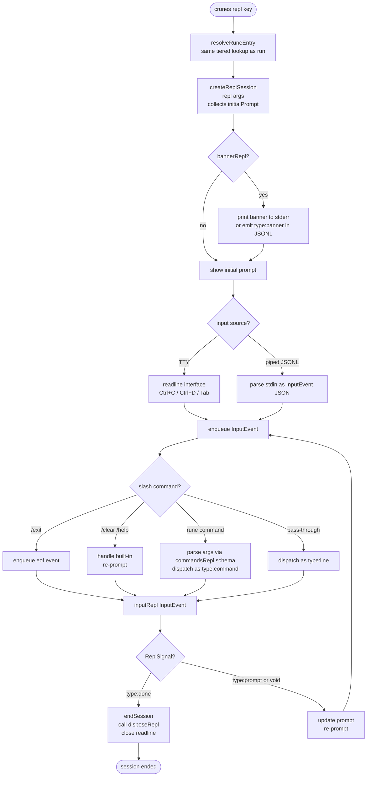

# `crunes repl` Execution Flow

> A rune REPL session starts, receives input events in a persistent isolate, and ends on Ctrl+D, `{ type: "done" }`, or signal teardown.

**Modules:** [[modules/rune]], [[modules/cli]], [[modules/shared]]

## Overview

`crunes repl <key>` resolves the rune entry the same way `crunes run` does, but instead of calling `run()` and tearing down, it calls `repl()` once to initialize state, then enters an event loop that calls `inputRepl()` on each user input. The isolate stays alive across the entire session — JS module-level variables are session state. The host process manages readline, slash command dispatch, tab completion, and multiline buffering; the rune only sees cooked `InputEvent` objects.

In JSONL mode (`--format jsonl`), stdin is read as newline-delimited JSON objects (`InputEvent`) and stdout emits JSON event objects — this is the wire protocol for programmatic clients and ACI hooks.

## Lifecycle

## Walkthrough

**Session initialization:** `createReplSession` runs `repl(args)` in the isolate and captures the return value as the initial prompt string (or `"> "` if void). This is the only time `repl` is called — it is not called per-input. If `bannerRepl()` is exported, it is called next and the result is written to stderr (text) or emitted as `{ type: "banner" }` (JSONL) before the first prompt appears.

**Async queue for piped input:** Readline fires all `line` events synchronously when stdin is a pipe, before any async handler has resolved. An explicit async queue (`let queue = Promise.resolve(); function enqueue(fn) { queue = queue.then(fn) }`) serializes all event handling, preventing interleaving. This is invisible to rune authors but critical for JSONL clients.

**Multiline input (TTY only):** Ctrl+Enter on TTY mode pushes the current line into a buffer and shows a continuation prompt indented to the same width as the main prompt. The next Enter flushes the full buffer as a single `{ type: 'line', text: 'line1\nline2\n...' }` event. Ctrl+C on a non-empty buffer clears it and re-prompts without sending an interrupt event.

**Tab completion:** If the rune exports `completeInputRepl(tokens)`, the host wires it to the readline completer. Tokens are the current input split on whitespace; the last element is the partial word being typed. The host filters the returned candidates by prefix and passes them to readline.

**Slash commands:** Lines starting with `/` are intercepted by the host before reaching `inputRepl`. Built-ins (`/exit`, `/clear`, `/help`) are handled entirely by the host. If the rune exports `commandsRepl()`, declared command names are dispatched to `inputRepl` as `{ type: 'command', args: ParsedArgs }`. Unrecognised slash commands pass through as normal `{ type: 'line' }` events.

**JSONL input mode:** When `--format jsonl` and stdin is not a TTY, each line is parsed as a JSON `InputEvent` object (`{ type, text? }` or `{ type: 'command', args }`) instead of being treated as raw text. Invalid JSON lines produce `{ type: 'error' }` on stdout.

**Programmatic spawning via `rune.spawn` / `rune.job.start`:** A parent rune can spawn a REPL session programmatically by passing `{ repl: true }` to `rune.spawn`, `rune.exec`, or `rune.job.start`. All three ultimately run `crunes repl --format jsonl <key>` — the same JSONL wire protocol described above. The parent communicates with the child using convenience methods that write JSONL `InputEvent` objects:

- `session.write(text)` → `{"type":"line","text":"..."}` — a normal input line
- `session.writeEof()` → `{"type":"eof","text":""}` — signals end of input (the child's REPL exits cleanly)
- `session.writeInterrupt()` → `{"type":"interrupt","text":""}` — equivalent to Ctrl+C
- `session.stdin.write(chunk)` — raw pipe access for pre-serialized JSONL

For detached jobs, `rune.job.write(id, text)` and `rune.job.writeEof(id)` append the same JSONL lines to a `stdin.log` file that the child tails via a poll-based reader — no live pipe required, and a new parent can resume writing after a restart.

**Session teardown:** `endSession` is idempotent (guarded by `sessionEnded` flag). It emits `session-end` (JSONL) or prints the done message (text), closes readline, and calls `session.dispose()` which runs `disposeRepl()` in the isolate. `disposeRepl` errors are swallowed.

## JSONL event shape (stdout)

| Event | When |
|-------|------|
| `{ type: 'session-start', rune, instance }` | Session initialized |
| `{ type: 'banner', rune, instance, message }` | `bannerRepl()` returned a string |
| `{ type: 'section', rune, instance, section }` | `section.emit()` called inside `inputRepl` |
| `{ type: 'log', rune, instance, level, message, meta? }` | `logger.*` or `console.*` inside isolate |
| `{ type: 'error', rune, instance, message }` | `inputRepl()` threw, or invalid JSONL input |
| `{ type: 'session-end', rune, instance, message? }` | Session ended (message from `{ type: 'done', message }`) |

## Key Decisions

- **Isolate stays alive across inputs** — The isolate is created once at session start and torn down at session end. Module-level variables persist as session state between `inputRepl` calls. This is what makes the REPL pattern useful — a rune can open a DB connection in `repl()` and query it in every `inputRepl()` call.

- **`argsRepl` is separate from `args`** — The REPL session uses `argsRepl()` to define its argument schema. If absent, `repl(args)` receives an empty args object — it does NOT fall back to the `args()` schema. This prevents REPL-specific options from appearing in `crunes run --help`.

- **Permissions are the `repl` lifecycle block** — REPL sessions require permissions declared under `"repl": { "allow": [...] }` in config, not under `"run"`. The two lifecycle blocks are completely independent.

- **Section filter (`--section`) applies per-event** — Unlike `crunes run` which filters post-execution, `repl` filters section events as they arrive from `onEvent`, discarding non-matching sections before they reach stdout.

- **Ctrl+C on empty buffer fires interrupt** — If the readline line is empty and the buffer is empty, Ctrl+C enqueues `{ type: 'interrupt', text: '' }`. The rune decides what to do (e.g., cancel in-progress work, or exit). If the readline line has content, Ctrl+C clears it without sending an event (standard terminal behavior).

## Error Paths

- **`repl()` throws** — The session fails to start; the error message is printed and the process exits 1. The isolate never enters the event loop.
- **`inputRepl()` throws** — The error is caught, printed to stderr (text) or emitted as `{ type: 'error' }` (JSONL), and the prompt is re-shown. The session continues.
- **Invalid JSONL input** — The offending line produces `{ type: 'error', message: 'Invalid JSONL input: ...' }` on stdout. The session continues.
- **`disposeRepl()` throws** — The error is swallowed. Teardown always completes.
