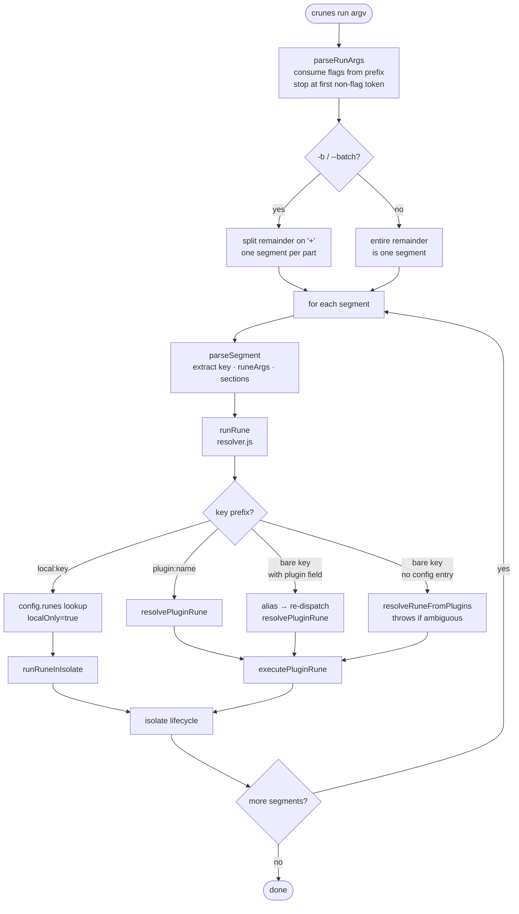
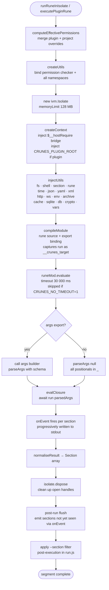

# `crunes run` Execution Flow

> One or more rune keys are resolved, each rune executes in a sandbox, and sections stream to stdout progressively.

**Modules:** [[modules/rune]], [[modules/cli]], [[modules/plugin]], [[modules/shared]]

## Overview

The `run` command uses prefix-only flag parsing: it consumes `--format`, `--fail-fast`, and `-b`/`--batch` from the start of argv and stops at the first non-flag token. This is intentional — runes receive everything after their key as raw arguments, so a rune can name its own parameter `--format` without colliding with the command-level flag. Once command flags are extracted, the remainder either forms one segment (default) or is split on `+` into multiple segments if `-b` was passed. The opt-in design of `--batch` prevents silent breakage of runes that legitimately use `+` in their own argument space.

Each segment names one rune, resolved through a four-tier chain: an explicit `local:` prefix forces config-only lookup; a `plugin:name` prefix targets a specific plugin; a bare key with a `plugin` field in config re-dispatches as an alias; a bare key with no config entry is auto-resolved across all enabled plugins. The isolate is then set up, utilities injected, the rune module evaluated, and the `run` export called. Sections flow to stdout in two waves: `onEvent` fires during execution for progressive output, and a post-run flush emits anything the rune returned but did not emit progressively.

The `jsonl` output format is not just for humans — it is the wire format `rune.exec` parses when it calls a child rune as a subprocess. This means the same render path serves both interactive streaming and inter-rune communication. Child spawns always receive `CRUNES_NO_TIMEOUT=1` so a slow child does not cascade into a timeout failure on the parent's 30-second budget.

## Walkthrough

**Prefix parsing stops early** — `parseRunArgs` walks argv token by token and halts the moment it sees something that is not a known flag. Everything from that point on belongs to the rune, including tokens that look like flags. This is what gives rune authors full control over their own argument space.

**Resolution tiers are tried in order** — `runRune` checks for an explicit prefix first, then a config alias, then falls through to plugin auto-resolution. The bare-key auto-resolver throws if more than one enabled plugin claims the same key, forcing the user to use the `plugin:key` form.

**Progressive emit plus post-run flush** — `onEvent` is called by the section utility inside the isolate as the rune runs. After `runRune` returns, `run.js` compares the returned `Section[]` against what was already emitted and flushes the remainder. Runes that stream sections and runes that accumulate and return them both produce complete output — the caller cannot tell the difference.

**`--section` filter lives outside the isolate** — The glob match runs in `run.js` after the rune has already finished. Rune authors can call `section.match()` inside their code to skip expensive generation for unselected sections, but the filter enforces regardless; the rune cannot bypass it.

## Error Paths

- **Unknown key** — `runRune` returns `null` when no resolver tier matches; the handler prints available rune keys and exits 1 before attempting further segments.
- **Ambiguous bare key** — Multiple enabled plugins claim the same bare key; the resolver throws and `run.js` prints the full `plugin:key` forms so the user can disambiguate.
- **Permission denied** — `PermissionError` is thrown inside the isolate and propagates as a rune failure; the message names the capability and value that was blocked.
- **Rune throws** — The unhandled exception is caught by `run.js`, the message is printed, and execution continues to the next segment unless `--fail-fast` is set, which exits immediately.
- **Circular alias chain** — Detected by the resolver's call-stack tracking and thrown as `CircularRuneError` with the full chain. Child-process calls via `rune.exec` are not in-process so they cannot form circular chains at the isolate level.
- **Flag before key** — `parseSegment` detects a flag token where the rune key is expected and prints a structured usage error showing the correct argument ordering.

## Key Decisions

- **Prefix-only flag parsing** — Stopping at the first non-flag token is the mechanism that isolates command-level flags from rune arguments. Violating this (e.g., scanning the whole argv for known flags) would silently consume arguments the rune expected to receive.

- **`--batch`/`-b` is opt-in** — Without `-b`, `+` reaches the rune as a literal argument. Making batch splitting automatic would break any rune that uses `+` in its own argument space with no warning.

- **`CRUNES_NO_TIMEOUT=1` on child spawns** — `rune.exec` and `rune.job.start` set this environment variable on the child process. Without it, a parent rune with 5 seconds left on its budget could spawn a child that legitimately needs 20 seconds and the whole operation would fail mid-way. The parent's timeout is the practical ceiling; the child runs unconstrained within it.

- **`normaliseResult` always returns an array** — `null` becomes `[]`, a single section object becomes a one-element array, an array passes through. Callers never branch on the shape of the return value.
