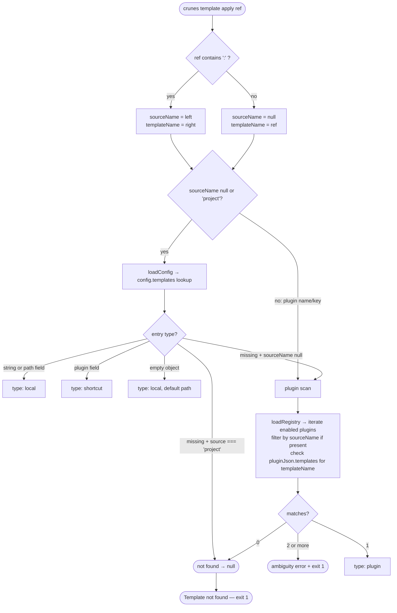
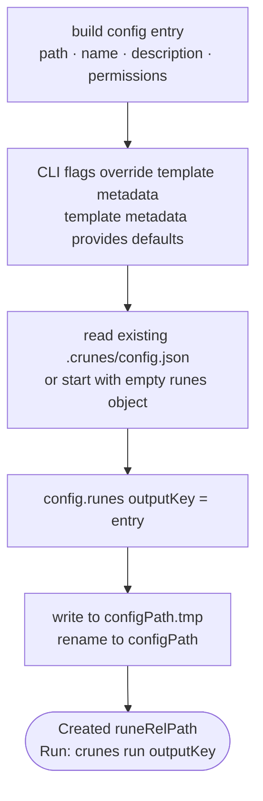

# `crunes template apply` Flow

> A template is resolved from one of three sources (local config, shortcut alias, or installed plugin), copied into the project, and registered as a rune in `.crunes/config.json`.

**Modules:** [[modules/template]], [[modules/plugin]], [[modules/core]], [[modules/shared]]

## Overview

Applying a template resolves it through a three-tier priority chain, copies the template file into the project, and writes the result as a runnable rune entry. The resolution order — project config first, then plugins — means projects maintain control over their template namespace. An explicit `source:` prefix bypasses the project config check and goes straight to plugin resolution.

Templates from plugins carry their declared permissions into the resulting rune entry. When a template is applied, the user gets a ready-to-run rune with correct permission declarations pre-filled — no manual permission wiring needed after apply. The entry is written into `config.runes`, not `config.templates`, so the result is immediately executable via `crunes run <key>`.

Shortcut entries let projects alias plugin templates under project-specific names. A shortcut says "this project's term for a thing is actually this plugin's template" — and when applied, the shortcut's `name` and `description` override the plugin's before the config entry is written. The plugin file is never modified; only the metadata that appears to the user changes.

## Walkthrough

### Parsing and Resolution



**Project config has priority.** A bare name without `source:` checks `config.templates` first; only if nothing matches does the flow fall through to the plugin scan. A `source:` prefix skips the project config entirely and filters the scan to that plugin. If the scan finds more than one plugin with the same template key and no source prefix was given, it exits 1 with the list of matches — use `pluginName:templateName` to disambiguate.

### Output Path, Overwrite, and Copy

```mermaid
flowchart TD
    A[resolved template] --> B[outputKey = --as flag ?? templateName\nruneRelPath = --path flag ?? .crunes/runes/outputKey.js]
    B --> C{file exists?}
    C -- no --> F
    C -- yes + TTY and no --yes --> D{confirm overwrite?}
    D -- decline --> E([Cancelled. — exit 0])
    D -- accept --> F[mkdir recursive]
    C -- yes + non-interactive or --yes --> F
    F --> G{resolution type?}
    G -- local --> H[fs.copyFile entry.path → runeAbsPath\ntemplateMeta = entry fields]
    G -- shortcut --> I[resolvePluginKey by bare name\nloadPluginJson\nfs.copyFile plugin path → runeAbsPath\ntemplateMeta = plugin meta + shortcut overrides]
    G -- plugin --> J[fs.copyFile plugin path → runeAbsPath\ntemplateMeta = pluginJson.templates entry]
```

**`--as <key>`** sets both the `config.runes` key and the default file path together; **`--path`** overrides only the file path, leaving the key unchanged. The shortcut branch is the most nuanced: `resolvePluginKey` looks up the plugin by bare name and throws on ambiguity; then `plugin.json` is loaded; then the shortcut entry's `name` and `description` are merged on top of the plugin's metadata — the project's terminology wins.

### Config Write



**The config write is atomic.** The file is written to a `.tmp` path first, then renamed, so a mid-write crash leaves the old config intact. The entry always lands in `config.runes` — the rune is immediately runnable with no further setup.

## Error Paths

- **Template not found:** `resolveTemplate` exhausts all tiers with no match; prints "Run: crunes template list" and exits 1.
- **Ambiguous bare template name:** two or more enabled plugins declare the same key; exits 1 listing the matching sources — use `pluginName:templateName` to resolve.
- **Shortcut plugin not installed:** `resolvePluginKey` returns null; exits 1 with a hint to install the plugin first.
- **Shortcut template key missing from plugin:** the resolved plugin's `plugin.json` has no entry for the requested key; exits 1.
- **Template file missing from plugin directory:** `fs.copyFile` throws `ENOENT` — `plugin.json` declares a template whose file does not exist; the plugin is broken; propagates to the top-level error handler.
- **Overwrite declined (interactive):** exits 0 with "Cancelled."

## Key Decisions

- **Project config priority over plugins:** resolution checks `config.templates` first, giving projects control over their template namespace without plugin shadowing. An explicit `source:` prefix overrides this when you need to reach a plugin directly.
- **Shortcut metadata merge order:** the shortcut entry's `name` and `description` override the plugin's — projects rename templates for their own terminology, and users see the project's name in `crunes template list`, not the plugin author's. The plugin file is never touched.
- **`--as` couples key and path; `--path` decouples them:** `--as other-key` changes both the `config.runes` key and the default file path to `.crunes/runes/other-key.js`; `--path` changes only the file location, letting the key and path be set independently.
- **Atomic config write:** `.tmp` rename means the old config survives any mid-write failure. The entry always goes into `config.runes`, not `config.templates` — the result is a runnable rune, not a template definition.
